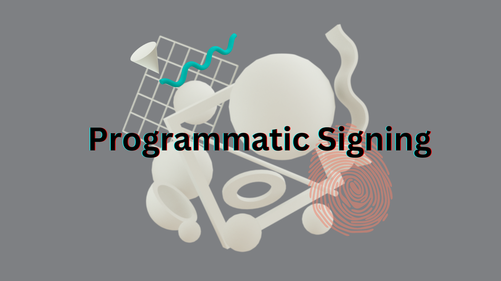

# 4. Programmatic Signing


As a distributed key management network, Lit provides developers with the ability to add programmable signing to their applications and wallets. These distributed wallets are known as Programmable Key Pairs (PKP) and the application logic that dictates when and why that key-pair will sign is known as a Lit Action.

---

## Objectives
At completion of this reading you should be able to:

- Explain how Lit Actions and Programmable Key Pairs (PKPs) work together.
- Mint a PKP through the PKP explorer.
- Summarize use cases for programmatic signing.

---

## Lit Actions and Programmable Key Pairs (PKPs)
Lit Actions are JavaScript programs that can be used to specify signing and authentication logic for PKPs. When used in conjunction with PKPs, Lit Actions are functionally serverless functions with their own private key-pair. Together these tools can be used to write data to blockchains and other state machines.

Every Lit Action gets executed across Lit’s threshold cryptography network in parallel, meaning the result of each program is independently verified by each node. Once a threshold of nodes have verified the result (more than two-thirds of network participants), the signing or decryption logic defined therein can be executed.


## How do Lit Actions and PKPs work together?
A user can create a new PKP and grant a Lit Action the right to sign using it. This means the distributed key has the ability to sign and decrypt arbitrary data based on pre-defined logic and conditions.

### Why is this useful?
A programmable distributed key is a primitive with a number of potential use cases. For example, using a PKP and Lit Actions for onboarding web2 users to wallets based on modern multi-factor authentication (withouth relying on a central authority or key custodian).

Additionally, Lit Actions + PKPs + web3 storage can be a replacement for a traditional web2 backend. Consider a web3-based Twitter alternative that utilizes [Ceramic](https://ceramic.network/) as its data storage solution. By creating a PKP associated with a Ceramic stream and granting specific Lit Actions the capability to sign with that PKP, you can emulate the functionality of a web2 backend. The Lit Actions can enforce business logic to ensure that only accurate data is written to the Ceramic stream. A `likePost()` Lit Action could verify whether a user has already liked a post before allowing the like to be recorded in the stream.

With Lit and web3 storage like Ceramic, you can empower Lit Actions to assume an "admin mode" role over a Ceramic stream. This is achieved by granting the Lit Action the ability to sign with the PKP associated with the stream. Nonetheless, it is crucial to note that the Lit Action will strictly adhere to the logic implemented within its code, ensuring that data is written to the stream in accordance with the specified rules. 

This seamless transition from a centralized web2 model to a decentralized web3 paradigm is greatly simplified through the capabilities provided by Lit.

## Programmable Key Pairs

Each Programmable Key Pair (PKP) is a versatile multi-party computation wallet that can be utilized by developers to:

- Provide users of web3 with seamless, "seed-phraseless" onboarding experiences.
- Facilitate transaction execution on blockchains, storage networks, and other state machines.
- Build fully decentralized application backends.

### Mint via Contracts
You'll need to get some [LIT testnet tokens](https://chronicle-faucet-app.vercel.app/) before you can mint a PKP on [Chronicle](https://explorer.litprotocol.com/mint-pkp) - Lit's custom EVM rollup testnet. This NFT represents the root ownership of the PKP. The NFT owner can grant additional parties (via a wallet address) or grant Lit Actions the ability to use the PKP to sign and decrypt data. They also have the ability to assign additional authentication methods.

### Mint via Social
You can mint a PKP by presenting a valid OAuth token as an authentication method to the Lit Relay server. Currently, only Google OAuth tokens are supported, but we plan to support Discord in the near term.

Read more about this process [here](https://developer.litprotocol.com/pkp/wallets/examples).

## Working with Lit Actions

Developers can utilize Lit Actions to introduce signing automation to their web3 apps. Below is an example of conditional signing.

You must install the [Lit Actions SDK](https://actions-docs.litprotocol.com/). The SDK provides JS function bindings to do things like request a signature or a decryption key.

You can explore some [examples](https://developer.litprotocol.com/SDK/Explanation/litActions#hello-world) in our docs.

### Conditional Signing[](https://developer.litprotocol.com/SDK/Explanation/litActions#conditional-signing)

Lit Actions inherit the powerful condition checking that Lit Protocol utilizes for Access Control. You can easily check any on-chain condition inside a Lit Action.

The example will check if the user has at least 1 Wei on Ethereum, and only sign if they do.

```js
import LitJsSdk from "lit-js-sdk/build/index.node.js";

// this code will be run on the node
const litActionCode = `
const go = async () => {
  // test an access control condition
  const testResult = await Lit.Actions.checkConditions({conditions, authSig, chain})

  console.log('testResult', testResult)

  // only sign if the access condition is true
  if (!testResult){
    return;
  }

  // this is the string "Hello World" for testing
  const toSign = [72, 101, 108, 108, 111, 32, 87, 111, 114, 108, 100];
  // this requests a signature share from the Lit Node
  // the signature share will be automatically returned in the HTTP response from the node
  const sigShare = await LitActions.signEcdsa({ toSign, publicKey: "0x02e5896d70c1bc4b4844458748fe0f936c7919d7968341e391fb6d82c258192e64", sigName: "sig1" });
};

go();
`;

// you need an AuthSig to auth with the nodes
// normally you would obtain an AuthSig by calling LitJsSdk.checkAndSignAuthMessage({chain})
const authSig = {
  sig: "0x2bdede6164f56a601fc17a8a78327d28b54e87cf3fa20373fca1d73b804566736d76efe2dd79a4627870a50e66e1a9050ca333b6f98d9415d8bca424980611ca1c",
  derivedVia: "web3.eth.personal.sign",
  signedMessage:
    "localhost wants you to sign in with your Ethereum account:\n0x9D1a5EC58232A894eBFcB5e466E3075b23101B89\n\nThis is a key for Partiful\n\nURI: https://localhost/login\nVersion: 1\nChain ID: 1\nNonce: 1LF00rraLO4f7ZSIt\nIssued At: 2022-06-03T05:59:09.959Z",
  address: "0x9D1a5EC58232A894eBFcB5e466E3075b23101B89",
};

const runLitAction = async () => {
  const litNodeClient = new LitJsSdk.LitNodeClient({
    litNetwork: "serrano",
  });
  await litNodeClient.connect();
  const signatures = await litNodeClient.executeJs({
    code: litActionCode,
    authSig,
    jsParams: {
      conditions: [
        {
          conditionType: "evmBasic",
          contractAddress: "",
          standardContractType: "",
          chain: "ethereum",
          method: "eth_getBalance",
          parameters: [":userAddress", "latest"],
          returnValueTest: {
            comparator: ">=",
            value: "1",
          },
        },
      ],
      authSig: {
        sig: "0x2bdede6164f56a601fc17a8a78327d28b54e87cf3fa20373fca1d73b804566736d76efe2dd79a4627870a50e66e1a9050ca333b6f98d9415d8bca424980611ca1c",
        derivedVia: "web3.eth.personal.sign",
        signedMessage:
          "localhost wants you to sign in with your Ethereum account:\n0x9D1a5EC58232A894eBFcB5e466E3075b23101B89\n\nThis is a key for Partiful\n\nURI: https://localhost/login\nVersion: 1\nChain ID: 1\nNonce: 1LF00rraLO4f7ZSIt\nIssued At: 2022-06-03T05:59:09.959Z",
        address: "0x9D1a5EC58232A894eBFcB5e466E3075b23101B89",
      },
      chain: "ethereum",
    },
  });
  console.log("signatures: ", signatures);
};

runLitAction();
```

## Use Cases

Automation and interoperability to the dWeb with Lit Actions and PKPs.

Below you will find some example projects and other potential ideas and use cases.

**DeFi Automation**

Use PKPs and Actions to automate your interactions across decentralized finance.

- Condition-based transactions (ex. on-chain limit orders).
- Recurring payments.
- Automated vault applications for seamlessly trading asset bundles.

Example Projects:

- [Sling Protocol](https://github.com/Sling-Protocol/pkp-dex-sdk): An SDK for automating transactions on popular DEXs. Currently supports Uniswap V3 and 1inch.
- [Cask](https://www.cask.fi/): Automated, recurring payments.

**Infrastructure**

Build powerful infrastructure that harnesses the power of Lit!

- Cross-chain bridges.
- Oracles for off-chain data.
- Event listening and condition-based execution.
- Privacy-preserving transactions.
- Decentralized key custodians.

Example Projects:

- [Yacht Labs](https://yachtlabs.io/blog/yacht-lit-swap): Cross-chain atomic swaps with PKPs and Lit Actions
- [Curve Labs](https://github.com/Curve-Labs/lit-privacy/tree/main): SDK for building privacy-preserving interactions on-chain

**Web3 Social**

Social applications that empower users with privacy and true data ownership.

- Credentialing systems for privacy-preserving web3 login.
- User owned social graphs.
- Account abstraction with support for web2 auth methods (i.e. Apple Passkey).
- Verifiable, on-chain reputation building.

Example Projects:

- [Krebit](https://spark.litprotocol.com/krebitxlitactions/): Automated Verifiable Credential issuance.
- [Wallet Abstraction demo](https://spark.litprotocol.com/wallet-abstraction-with-google-oauth/): Using Google oAuth to create a Lit MPC wallet.

**Gaming**

Improve the state of [web3 gaming](https://spark.litprotocol.com/lit-and-web3-gaming/).

- Signing and wallet abstraction for blockchain-based games.
- NPCs!
- Condition-based reward systems and achievements.
- Private data for multiplayer games.
